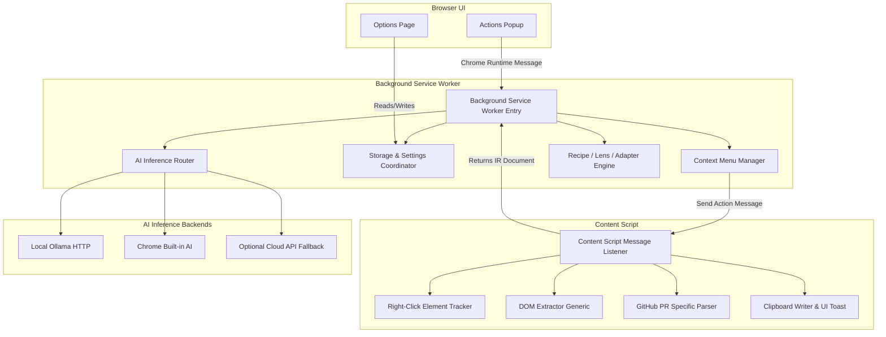

# Implementation Plan: ContextScribe Browser Extension

Provide a detailed plan to build **ContextScribe**, a Chrome Extension (Manifest V3) designed to capture DOM elements, page text, or complete page structures and convert them into clean Markdown. It applies Recipes (transformations), Lenses (audience perspective), and Destination Adapters (downstream paste format) via deterministic routines or AI inference models (Ollama, Chrome Built-in AI, etc.).

---

## 1. Product Summary
ContextScribe is a browser extension that allows users to right-click any webpage element, text selection, or the entire page, and convert that content into clean Markdown or AI-optimized context. By selecting a target **Recipe** (what details to synthesize), **Lens** (the perspective or framing), and **Destination Adapter** (the formatting constraints of the destination app), the user receives high-fidelity structured text directly in their clipboard.

---

## 2. Target Users
- **Software Engineers & Reviewers**: Capturing code reviews, PR comment threads, and code snippets for downstream AI coding agents (Claude Code, Cursor, Copilot).
- **QA Engineers & Support Specialists**: Extracting user interfaces, console errors, or bug descriptions to create structured tickets in Jira or GitHub Issues.
- **Product Managers & technical writers**: Structuring executive summaries, product feedback, or feature lists from visual elements on a webpage.
- **Researchers & Knowledge Workers**: Scraping structured content sections into personal knowledge bases like Obsidian or Notion.

---

## 3. Key Differentiators
- **Structure-Aware Extraction**: Unlike generic HTML-to-Markdown tools that flatten text, ContextScribe preserves the DOM node tree hierarchy, maintaining header weights, tables, quotes, code blocks, and reply chains.
- **Decoupled Formatting Layers**: Separates the extraction/synthesis instructions (Recipe), perspective/audience filtering (Lens), and platform-specific styling constraints (Destination Adapter).
- **Deep GitHub PR Integration**: Specialized DOM parsing that automatically recognizes resolved/unresolved threads, human vs. AI Copilot authors, diff hunk file paths, and implements visual expand/collapse controls.
- **Offline & Privacy-First**: Zero tracking, local processing, and default deterministic (no-AI) conversion. Optional local AI integrations (Ollama, Chrome Built-in AI API) with clear configuration scopes.

---

## 4. MVP Definition (v0.1)
- **Manifest V3 Core**: Service worker, content script, options page, actions popup.
- **Right-Click Element Tracking**: Content script tracks `contextmenu` event target in memory.
- **Generic DOM Parser**: Formats text, headers, lists, code snippets, links, and tables to a standard Intermediate Representation (IR).
- **Markdown Serializer**: Converts IR into standard CommonMark formatting.
- **Deterministic AI Coding Agent Brief Recipe**: Outputs structured PR code briefs locally without calling any AI backend.
- **Ollama Provider Integration**: Basic POST runner to local Ollama API (`/api/generate`).
- **Chrome Built-in AI stub**: Detector for `window.ai` / `chrome.aiOriginTrial` APIs.
- **Clipboard Output**: Actionable write-to-clipboard function via content script.
- **Basic GitHub PR tools**: Copy selected PR review thread with file headers.

---

## 5. Non-Goals for v1
- Cross-browser packaging for Safari or Firefox (architected with abstraction but not packaged).
- Dynamic custom recipe creator UI (recipes are declared in a TS configuration file; custom editing UI deferred to v0.2).
- Native host messaging companion app.
- Shared cloud sync database for recipes.
- Visual highlighting overlay on right-clicked nodes (deferred to v0.2 to avoid DOM pollution).

---

## 6. Architecture Diagram



---

## 7. Extension File/Module Structure

```
ContextScribe/
├── manifest.json                  # Manifest V3 Extension entry point
├── package.json                   # Project dependencies and build scripts
├── tsconfig.json                  # TypeScript compiler settings
├── vite.config.ts                 # Build configuration
└── src/
    ├── background/
    │   ├── index.ts               # Sw initialization & message dispatcher
    │   ├── contextMenus.ts        # Dynamic context menus definition & clicks
    │   ├── settings.ts            # Settings load/save manager
    │   └── inference/
    │       ├── index.ts           # Router interface for model invocation
    │       ├── ollama.ts          # Ollama driver implementation
    │       ├── chromeAI.ts        # Built-in AI driver implementation
    │       └── deterministic.ts   # No-AI fallback serialization
    ├── content/
    │   ├── index.ts               # Message listener routing
    │   ├── tracker.ts             # Tracking event.target on right-clicks
    │   ├── toast.ts               # HTML/CSS toast alert injector
    │   ├── extractor/
    │   │   ├── index.ts           # Extractor orchestrator (router)
    │   │   ├── generic.ts         # Generic DOM traversal parser
    │   │   └── github.ts          # Special parsing selectors for GitHub PRs
    │   └── dom/
    │       └── githubExpander.ts  # GitHub comment thread expansion script
    ├── popup/
    │   ├── popup.html
    │   └── popup.ts
    ├── options/
    │   ├── options.html
    │   └── options.ts
    └── shared/
        ├── types.ts               # Core model contracts & TS definitions
        ├── ir.ts                  # Document IR node structure utilities
        ├── serializer.ts          # Converts IR to platform-specific Markdown
        └── config/
            ├── recipes.ts         # Declared Recipe configurations
            ├── lenses.ts          # Declared Lens configurations
            └── adapters.ts        # Declared Destination Adapters
```

---

## 8. Manifest Permissions Plan

The extension uses minimum-privilege permissions:

```json
{
  "manifest_version": 3,
  "name": "ContextScribe",
  "version": "0.0.1",
  "permissions": [
    "contextMenus",
    "storage",
    "scripting",
    "tabs"
  ],
  "host_permissions": [
    "<all_urls>"
  ]
}
```

### Justification of Permissions
- `contextMenus`: Required to register the context menu hierarchy, allowing users to trigger capture workflows directly.
- `storage`: Required to save settings, chosen provider configurations, API keys, and selected recipes/lenses.
- `scripting`: Required to inject and execute extraction scripts on active tabs dynamically when context menus are clicked.
- `tabs`: Required to read tab details (URL, title) to construct Markdown metadata and to determine if a specialized parser should be loaded.
- `host_permissions: ["https://github.com/*"]`: Specifically required to programmatically manipulate the DOM of GitHub PR pages (e.g. click thread expand/collapse toggles, execute detailed selector queries across nested frames) even when direct activeTab gestures are inactive.

---

## 9. Data Flow

```
[User Right-Click] ──> [Tracker captures element]
                             │
                       [User Menu Select]
                             │
                             v
                    [SW routes clicked cmd]
                             │
              (Runtime msg: EXTRACT_NODE)
                             │
                             v
                    [CS Extractor Runs] ──> [Generates IR object]
                             │
                             v
                  [CS returns IR Document]
                             │
                             v
                     [SW applies transformation]
                             │
                 [Inference Router rewrites] (Optional AI prompt step)
                             │
                             v
                 [SW compiles Markdown] (Destination Adapter flattens format)
                             │
              (Runtime msg: WRITE_TO_CLIPBOARD)
                             │
                             v
                  [CS Clipboard Write] ──> [Show Toast UI Confirmation]
```

---

## 10. DOM-Node Capture Strategy

### Context Menu Limitations
In Manifest V3, the background script's `chrome.contextMenus.onClicked` handler has no direct reference to the clicked DOM element on the page.

### Mitigation
1. **Global Capture Event Listener**: The content script runs a passive listener on the `contextmenu` event.
2. **Weak Reference Storage**: When a right-click is triggered, the content script stores the DOM node in a local variable.
3. **Target Retrieval**: When the service worker requests extraction, the content script processes the stored element.

```typescript
// src/content/tracker.ts
let lastClickedElement: HTMLElement | null = null;

document.addEventListener("contextmenu", (event: MouseEvent) => {
  lastClickedElement = event.target as HTMLElement;
}, { capture: true, passive: true });

export function getLastClickedElement(): HTMLElement {
  if (lastClickedElement && document.body.contains(lastClickedElement)) {
    return lastClickedElement;
  }
  // Fallbacks: active selection, active input, or full body
  const selection = window.getSelection();
  if (selection && selection.rangeCount > 0 && !selection.isCollapsed) {
    const range = selection.getRangeAt(0);
    const container = range.commonAncestorContainer;
    return (container.nodeType === Node.ELEMENT_NODE ? container : container.parentElement) as HTMLElement;
  }
  return (document.activeElement as HTMLElement) || document.body;
}
```

---

## 11. Markdown Conversion Strategy

Rather than importing heavy DOM-to-Markdown libraries (e.g., `turndown`), ContextScribe extracts structured elements from the DOM and maps them into an internal tree structure (Intermediate Representation). 
1. **Hierarchy Building**: Traverses element nodes recursively.
2. **Semantic Extraction**: Extracts standard DOM elements (`h1-h6`, `p`, `ul`, `ol`, `code`, `pre`, `blockquote`, `table`).
3. **Dialect Customization**: The intermediate representation is serialized by the `Destination Adapter` which handles platform quirks (e.g. Slack bold tags, Jira ticket formats).

---

## 12. Intermediate Representation (IR) Design

### Document Capture Definition
The root node structure representing the extracted content segment:

```typescript
export interface CaptureMetadata {
  title: string;
  url: string;
  timestamp: string;
  selectorPath?: string;
}

export type IRBlockType = 
  | "root"
  | "heading"
  | "paragraph"
  | "list"
  | "list-item"
  | "code-block"
  | "blockquote"
  | "table"
  | "table-row"
  | "table-header-cell"
  | "table-cell"
  | "comment-thread"
  | "comment";

export interface IRBlock {
  type: IRBlockType;
  text?: string;
  level?: number;             // Heading level (1-6)
  language?: string;          // Code language (e.g., typescript, python)
  metadata?: {
    author?: string;
    authorAvatar?: string;
    timestamp?: string;
    isUnresolved?: boolean;
    isAiGenerated?: boolean;
    filePath?: string;
    lineRange?: string;
    [key: string]: any;
  };
  children?: IRBlock[];
}

export interface DocumentIR {
  meta: CaptureMetadata;
  root: IRBlock;
}
```

---

## 13. Recipe/Lens/Adapter Design

ContextScribe processes the extracted representation using three declarative components:

```
[DocumentIR] ──> [Recipe Transformer] ──> [Lens Filter] ──> [Destination Adapter]
```

### 1. Recipe
Acts as the transformer. Defines how the raw structure is restructured, grouped, or summarized.
```typescript
export interface Recipe {
  id: string;
  name: string;
  description: string;
  aiTemplate?: string;       // Prompt to rewrite the IR
  // Offline deterministic transformer
  transform: (doc: DocumentIR) => DocumentIR; 
}
```

### 2. Lens
Represents the perspective filter. Filters or emphasizes specific nodes based on the target audience.
```typescript
export interface Lens {
  id: string;
  name: string;
  focusArea: string;          // Description of priority elements
  aiSystemPrompt?: string;    // Extra system constraints injected into the AI
  filter: (block: IRBlock) => boolean; // Offline visibility filter
}
```

### 3. Destination Adapter
Formats the output for the target pasting application.
```typescript
export interface DestinationAdapter {
  id: string;
  name: string;
  flavor: "commonmark" | "gfm" | "slack" | "jira" | "notion";
  maxChars?: number;
  format: (markdown: string, meta: CaptureMetadata) => string;
}
```

---

## 14. AI Provider Abstraction

An abstraction interface allows switching between offline processing and various local or cloud-based AI providers.

```typescript
export interface ProviderResponse {
  text: string;
  usage?: { promptTokens: number; completionTokens: number };
}

export interface InferenceProvider {
  id: string;
  name: string;
  isAvailable: () => Promise<boolean>;
  generate: (systemPrompt: string, userPrompt: string) => Promise<ProviderResponse>;
}
```

### Supported Backends in v1:
1. **Deterministic (None)**: Offline parser. Skips LLM rewrite, prints serialized markdown.
2. **Ollama**: Calls local endpoint (`http://localhost:11434/api/chat`).
3. **Chrome Built-in AI**: Uses Chrome's `ai.languageModel` API if supported in user's browser.
4. **LM Studio**: Compatible with OpenAI endpoint formats mapping locally to `http://localhost:1234/v1`.

---

## 15. GitHub PR Integration Plan

### Target URL Detections
The background script triggers the specialized GitHub parser when target tab satisfies `*://github.com/*/pull/*`.

### DOM Selectors & Strategy
To maintain stability, the parser uses robust attribute-based selectors alongside semantic layout chains.

| Data Point | Selector Pattern / Strategy |
|------------|-----------------------------|
| **PR Title** | `h1.gh-header-title span.js-issue-title` |
| **Comment Thread** | `div.js-comment-container` or `div[class*="review-comment"]` |
| **Comment Body** | `td.comment-body` / `div.comment-body` |
| **Comment Author** | `a.author` or tag `[data-hovercard-type="user"]` |
| **Unresolved Status** | Elements containing button label `"Resolve conversation"` or lack of `"Resolved"` flags |
| **Copilot Review Comment**| DOM contains `img[alt*="copilot"]`, or header label with `copilot` class |
| **File Path Headers** | Heading container above diff node `div.file-header` or data attribute `data-path` |

### Extractor Parser
The GitHub parser traverses discussion trees and maps them to an array of `comment-thread` and `comment` IR blocks.

---

## 16. Expand/Collapse Resolved Comment Strategy

GitHub PR comment threads are often collapsed behind `<details>` elements or toggle buttons (`"Show resolved"`).
To process these, the extension injects a programmatic expand utility.

```typescript
// src/content/dom/githubExpander.ts
export async function toggleGitHubResolvedThreads(action: "expand" | "collapse"): Promise<number> {
  const detailsElements = document.querySelectorAll("details.discussion-details");
  let count = 0;

  detailsElements.forEach((el) => {
    const isExpanded = el.hasAttribute("open");
    if (action === "expand" && !isExpanded) {
      el.setAttribute("open", "");
      count++;
    } else if (action === "collapse" && isExpanded) {
      el.removeAttribute("open");
      count++;
    }
  });

  // Also handle buttons like "Show resolved"
  const showButtons = document.querySelectorAll("button.show-resolved-button, .js-toggle-outdated-comments");
  if (action === "expand") {
    showButtons.forEach((btn) => {
      (btn as HTMLButtonElement).click();
      count++;
    });
  }

  return count;
}
```

---

## 17. Security & Privacy Review

ContextScribe is built on a **zero-trust, local-first** design.

- **Data Privacy**: No webpage content, extracted URLs, or metadata are transmitted to external servers. If a user configures a cloud API (e.g. OpenAI/Anthropic), the extension displays a warning: *"Using this option will transmit the content of the selected elements to a remote cloud API."*
- **Form Field Exclusion**: The parser skips input fields (`type="password"`, `type="hidden"`, and selectors matching common token/credential fields) by default to prevent accidental capture of secrets.
- **No Remote Code Execution**: All transformation logic, parsers, and prompt templates are bundled locally inside the extension folder to align with Chrome Web Store security guidelines.

---

## 18. Testing Strategy

1. **Unit Tests (Vitest)**:
   - Validate that `serializer.ts` outputs valid Markdown formats.
   - Assert that the offline deterministic recipes transform IR trees correctly.
2. **Selector Fixture Tests**:
   - Save local HTML files containing GitHub PR comment threads.
   - Run the specialized GitHub parser against the fixtures to verify target elements are correctly parsed.
3. **Integration Verification**:
   - Automate Chrome launch using Puppeteer/Playwright to verify extension installation, context menu rendering, and clipboard actions.

---

## 19. Risks and Mitigations

| Risk | Impact | Mitigation Strategy |
|------|--------|---------------------|
| **GitHub DOM Changes** | High | Use semantic attribute queries (`data-path`, `[data-hovercard-type="user"]`) rather than relying purely on CSS class selectors. Run automated daily tests against GitHub layout fixtures. |
| **Inference Latency** | Medium | Provide streaming UI feedback. If Ollama takes > 5 seconds, show a progress loader or provide an option to cancel and copy the raw deterministic Markdown instead. |
| **Clipboard Failures in Background** | High | Never attempt to write to the clipboard inside the background service worker. Always delegate the clipboard write to the content script of the active tab. |

---

## 20. Step-by-Step Implementation Milestones

### Milestone 1: Core Extension Setup (1-2 days)
- [ ] Initialize project with Vite + TypeScript.
- [ ] Add `manifest.json` with permissions (`contextMenus`, `storage`, `scripting`, `tabs`).
- [ ] Create Options page for settings and popup page for status reports.
- [ ] Register context menus in service worker script.

### Milestone 2: Parser & Serializer Core (2-3 days)
- [ ] Implement right-click tracking in content script.
- [ ] Build the generic DOM-to-IR parser.
- [ ] Write the IR-to-Markdown serializer.
- [ ] Wire up direct clipboard writing and show toast confirmations on target tabs.

### Milestone 3: Specialized GitHub PR Support (2 days)
- [ ] Add GitHub URL checking routes.
- [ ] Build specialized CSS/attribute selectors to extract comment trees and PR metadata.
- [ ] Create expand/collapse triggers for resolved discussions.

### Milestone 4: Transformation Engine & AI Providers (2-3 days)
- [ ] Write the core Recipe/Lens/Adapter drivers.
- [ ] Implement local Ollama API connectors and verify Prompt API configurations.
- [ ] Establish fallback mechanisms to ensure raw copies work when AI integrations are offline.

### Milestone 5: Optimization & Review (1-2 days)
- [ ] Fix formatting issues with tables and complex nested quotes.
- [ ] Check Chrome Extension Security Policy (CSP) guidelines.
- [ ] Prepare store packaging scripts.

---

## 21. Suggested TypeScript Interfaces
(Included in *Section 12* and *Section 13* above).

---

## 22. Example Prompt Templates

### System Prompt
```
You are a context extraction assistant. Convert the provided HTML/Markdown snippet into clean, structured Markdown, removing noise while preserving code syntax, list levels, tables, and comment flows.
- Never invent URLs, commit SHAs, or facts.
- Identify AI reviewer comments and label them clearly as [AI Review].
- Do not output preamble or conversational filler. Return only the formatted Markdown.
```

### AI Coding Agent Brief Template
```
Transform the following code review thread into an actionable development task brief.

Input Content:
{extractedMarkdown}

Target Audience (Lens): {lensFocus}
Destination Constraints (Adapter): {adapterFlavor}

Format the output:
1. High-level Summary: Explain what the reviewer requested.
2. File Changes List: Paths and line ranges affected.
3. Action Plan: Step-by-step checklist of fixes needed.
4. Open Questions/Ambiguities: List any items needing clarification.
```

---

## 23. Example Output Markdown

### 1. Generic Webpage Selection
```markdown
# Section: Architecture Guidelines
**Source**: [LookAtWhatAiCanDo Guidelines](https://github.com/example/docs/arch.md)
**Captured**: 2026-06-01 04:24:00

We enforce strict data isolation between service workers and content scripts.

> **Crucial Rule**:
> Never call clipboard write operations inside the service worker context directly.

| Module | Location | Context |
| :--- | :--- | :--- |
| Service Worker | `src/background/` | Background |
| Content Script | `src/content/` | Document Page |
```

### 2. GitHub Copilot Review Thread
```markdown
### Discussion: `src/background/index.ts`
- **Comment #1** [AI Review (Copilot)]
  - **Author**: @copilot
  - **Review Feed**: The service worker registration handles error events but lacks a crash restart threshold. Consider adding a retry counter.
- **Reply**:
  - **Author**: @developer-one
  - **Response**: Good suggestion, adding a maximum retry threshold of 3 attempts.
```

### 3. Full PR Review Handoff
```markdown
# Code Review Handoff Brief
**PR Title**: Refactor Storage Layer (#114)
**Repository**: `LookAtWhatAiCanDo/ContextScribe`
**Branch**: `feature/refactor-storage` -> `main`

## Summary of Active Feedbacks

### File: `src/shared/storage.ts`
- **Thread #1** (Unresolved)
  - **Author**: @senior-reviewer
  - **Issue**: Using `localStorage` is not supported in extension service workers. We must migrate to `chrome.storage.local`.
  - **Action Item**: Replace instances of `localStorage.setItem` and `getItem` with asynchronous `chrome.storage.local` API calls.

### File: `manifest.json`
- **Thread #2** (Resolved)
  - **Author**: @security-scanner (AI)
  - **Issue**: Excessive permissions declared. Removed `"unlimitedStorage"` as it is not needed for MVP configuration.
```

---

## 24. Recommended Project Structure
(Included in *Section 7* above).

---

## 25. Open Questions Before Coding

> [!IMPORTANT]
> 1. **Do we need custom styles for the options page?** The guidelines suggest using clean, responsive styling. Should we use vanilla CSS or configure a bundle compiler? *Recommended approach: Vite with vanilla CSS using standard modern variables (HSL, sleek dark mode).*
> 2. **Ollama connection constraints:** Since extension content scripts and options pages run in separate extension origins, should we configure Ollama's CORS origins, or should the extension service worker proxy the fetch calls? *Recommended approach: Service worker handles all HTTP requests to prevent CORS blockages on page sites.*
